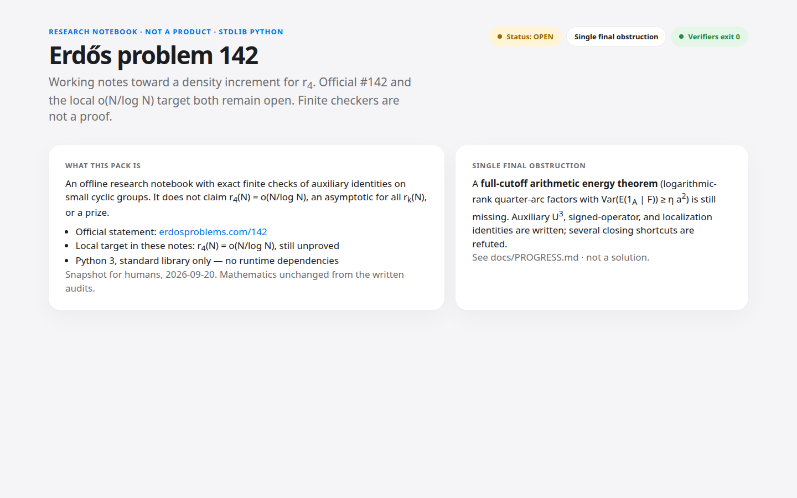
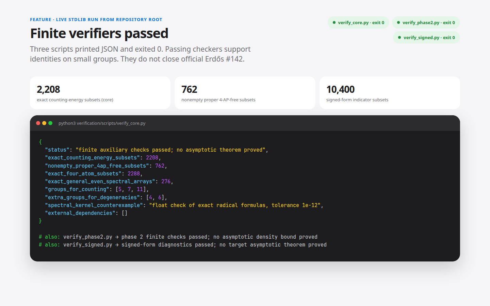

<!-- SPDX-License-Identifier: Apache-2.0 -->
<!-- Copyright 2026 Mangesh Raut -->

<p align="center">
  
  
  
</p>

<h1 align="center">Erdős problem 142</h1>

<p align="center">
  Research notebook — density-increment notes for <em>r</em><sub>4</sub>, finite checkers, and an honest remaining obstruction.<br>
  Not a product. Not a solution.
</p>

<p align="center">
  <a href="docs/PROGRESS.md">Progress</a> ·
  <a href="docs/ROADMAP.md">Roadmap</a> ·
  <a href="docs/literature/OFFICIAL_142.md">Official #142</a> ·
  <a href="docs/audits/">Audits</a> ·
  <a href="https://www.erdosproblems.com/142">erdosproblems.com/142</a>
</p>

> [!IMPORTANT]
> **Status: OPEN — single final obstruction.** Official Erdős #142 and the
> local target \(r_4(N)=o(N/\log N)\) are both still open in this pack.
> Passing Python checkers is not a proof. There is no new claimed
> asymptotic and no prize claim.

Author: [Mangesh Raut](https://github.com/mangeshraut712)
(`mbr63@drexel.edu`). Offline notes from **2026-09-06**, continued
through **2026-09-14**, now a public repository.

<p align="center">
  
</p>
<p align="center"><em>Overview — official #142 and the local <code>r₄(N)=o(N/log N)</code> target are both still open.</em></p>

<p align="center">
  
</p>
<p align="center"><em>Feature — live finite checkers from the repo root (JSON on stdout, exit 0). Not a proof.</em></p>

## At a glance

| Surface | Honest status |
|---|---|
| Official Erdős #142 | **OPEN** — prove an asymptotic for all \(r_k(N)\) |
| Local target in these notes | **OPEN** — \(r_4(N)=o(N/\log N)\) |
| Remaining closing input | Full-cutoff arithmetic energy theorem (named, unproved) |
| Finite checkers | 13 stdlib `verify_*.py` scripts; last captured run exit 0 |

Even a proof of the local target would **not** settle official #142
([MIXED_INCREMENT.md](docs/audits/MIXED_INCREMENT.md) §10).

## Problem (as used in these notes)

Let \(r_4(N)\) be the size of the largest subset of \(\{1,\ldots,N\}\)
with no 4-term arithmetic progression. The **local target** of the
increment program here is

\[
r_4(N)=o(N/\log N).
\]

That target is open. **Official Erdős problem 142** is also open and is
**not** settled by a \(k=4\) little-o bound of this shape even if one
were proved. Official statement:
[docs/literature/OFFICIAL_142.md](docs/literature/OFFICIAL_142.md);
live pages
[erdosproblems.com/142](https://www.erdosproblems.com/142) and
[latex/142](https://www.erdosproblems.com/latex/142).

If a bounty is listed anywhere, verify it on that site, OEIS, or the
literature. Historical prize remarks from the official commentary are
in [OFFICIAL_142.md](docs/literature/OFFICIAL_142.md); this pack does
not claim a live, collectable bounty.

## How far we are

Auxiliary identities (U³ lower bounds, relative-window counting,
signed-operator algebra, a localization bridge) are written and, where
claimed, checked on small cyclic groups. Several proposed closing lemmas
are **refuted** (unrestricted uniform energy; AP-richness as a substitute
for coarse energy; actual-U³ inverse with exponent \(C<2\); mixed mass
as a ready-made increment).

What remains is one sufficient closing input: a **full-cutoff arithmetic
energy theorem** (logarithmic-rank quarter-arc factors with
\(\mathrm{Var}(E(1_A\mid F))\ge\eta a^2\)). That is the “single final
obstruction.” Details, including the full-group \(\mathbb Z_p\) case and
the Freiman-embedded sphere family, are in
**[docs/PROGRESS.md](docs/PROGRESS.md)**. Next steps:
[docs/ROADMAP.md](docs/ROADMAP.md). Docs map:
[docs/README.md](docs/README.md).

## Quickstart (verifiers)

Python 3, **standard library only** (`pyproject.toml` lists no runtime
dependencies). From the repository root:

```bash
for s in verification/scripts/verify_*.py; do python3 "$s" || exit 1; done
```

Most scripts print JSON on stdout. Captured runs live in
`verification/results/`. `verify_full_group_energy.py` also **rewrites**
the tracked file
`verification/results/full_group_energy_verification.json`. Serialized
floats can differ from the committed capture and leave a clean checkout
dirty; do not commit that noise unless you mean to refresh the snapshot.
A passing script means the finite checks in that file succeeded. It is
not a proof of the local target.

Individual scripts (same thirteen files as the loop):

```bash
python3 verification/scripts/verify_core.py
python3 verification/scripts/verify_phase2.py
python3 verification/scripts/verify_signed.py
python3 verification/scripts/verify_relative.py
python3 verification/scripts/verify_increment.py
python3 verification/scripts/verify_mixed.py
python3 verification/scripts/verify_compat.py
python3 verification/scripts/verify_compatibility.py
python3 verification/scripts/verify_localization.py
python3 verification/scripts/verify_energy_counterexample.py
python3 verification/scripts/verify_ap_richness.py
python3 verification/scripts/verify_endpoint_incidence.py
python3 verification/scripts/verify_full_group_energy.py
```

After the 2026-09-14 layout change, all thirteen `verify_*.py` scripts
were rerun from the repo root; all exited 0. That does not change the
open status of the mathematics.

## Repository map

```
README.md                 this page (GitHub card)
LICENSE, NOTICE           Apache-2.0
CITATION.cff, AUTHORS     citation and author of record
CONTRIBUTING.md           DCO + CLA-lite
CODE_OF_CONDUCT.md, SECURITY.md
docs/README.md            docs index
docs/PROGRESS.md          proved / refuted / open
docs/ROADMAP.md           contribution ideas
docs/PRIORITY_AND_ATTRIBUTION.md
docs/status.html          static OPEN-status snapshot (no extra deps)
docs/screenshots/         README card images from that page
docs/literature/          external problem page; no invented bounty
docs/audits/              full research trail (markdown)
verification/scripts/     verify_*.py and _probe_terminal.py
verification/results/     captured JSON
pyproject.toml            metadata; stdlib-only
```

Codeowners: [@mangeshraut712](.github/CODEOWNERS).

## Contributing and sponsors

Patches that prove, refute, or correctly weaken the remaining energy
theorem are welcome. See [CONTRIBUTING.md](CONTRIBUTING.md): Apache-2.0
on contributions, DCO sign-off (`git commit -s`), do not strip
attribution, do not mark the problem solved from examples.

Sponsor the author via [GitHub Sponsors](https://github.com/sponsors/mangeshraut712)
or the [GitHub profile](https://github.com/mangeshraut712).

## Citation

```
Mangesh Raut, Erdős problem 142 research pack,
https://github.com/mangeshraut712/erdos142, 2026.
```

Machine-readable: [CITATION.cff](CITATION.cff). A Zenodo DOI is
recommended later; none is registered yet.

## License

Copyright 2026 Mangesh Raut. Licensed under the Apache License 2.0.
SPDX-License-Identifier: Apache-2.0. See [LICENSE](LICENSE) and
[NOTICE](NOTICE).

## Public copies

This repository is public on purpose. Cloning cannot be prevented.
Copyright headers, NOTICE, DCO/CLA-lite, and citation metadata exist so
that reuse keeps the author’s name and does not pretend the mathematics
is finished. They are not a secrecy mechanism.
See [docs/PRIORITY_AND_ATTRIBUTION.md](docs/PRIORITY_AND_ATTRIBUTION.md).
